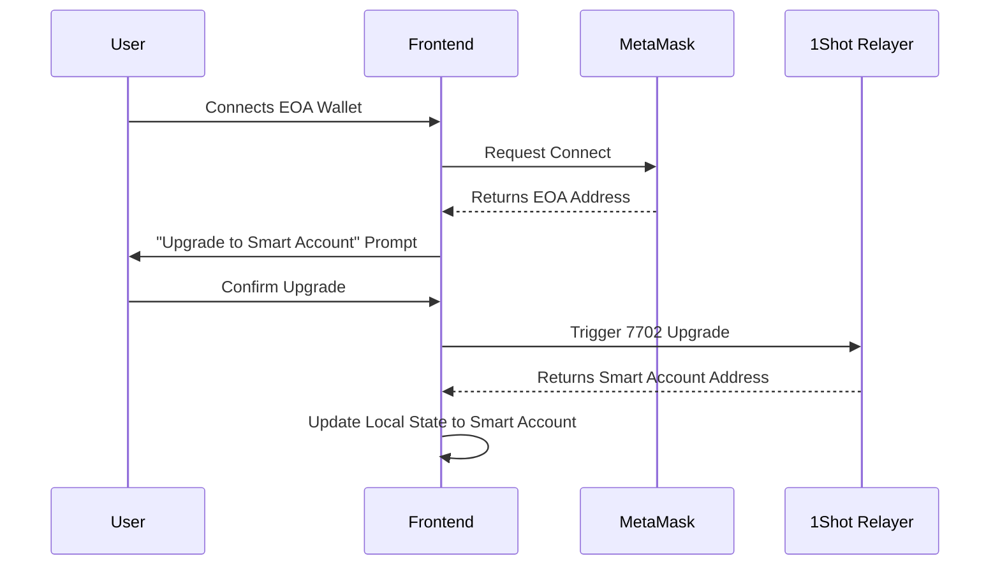
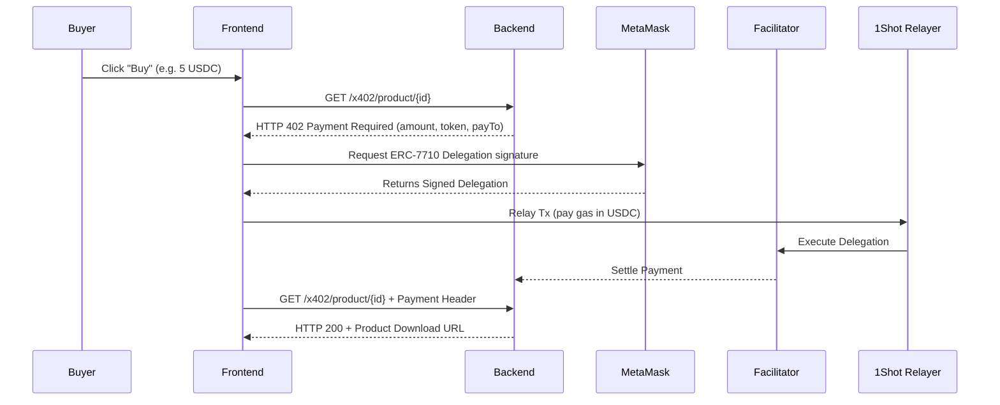
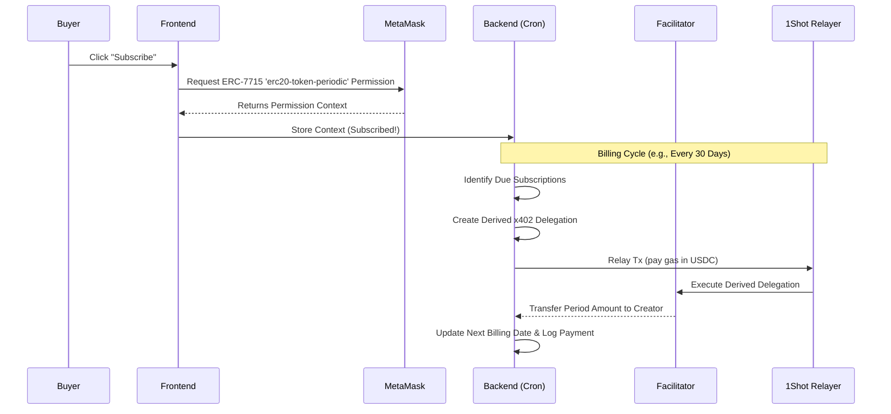
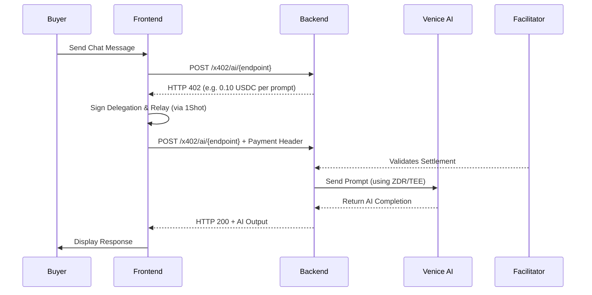

# 🛍️ CreatorPay – Decentralized Gumroad Alternative

**CreatorPay** is a decentralized platform where creators sell digital and AI-powered products, and buyers pay via MetaMask smart accounts using **x402**, **ERC-7710 delegations**, and **ERC-7715 Advanced Permissions**. 

By leveraging the **MetaMask Smart Accounts Kit**, **1Shot permissionless relayer**, and **Venice AI**, CreatorPay enables safe, gasless, and programmable micro-commerce between humans and agents.

---

## 🚀 Hackathon Highlights & Track Focus

This project was built to demonstrate real-world utility for **x402** and **Account Abstraction (ERC-7710/ERC-7715)**:
- **x402 Micro-payments**: Implemented HTTP 402 payment flows for digital downloads and AI endpoints.
- **ERC-7710 Delegations**: Seamless one-click purchasing via MetaMask smart accounts, routed through the MetaMask Facilitator.
- **ERC-7715 Advanced Permissions**: True recurring subscriptions managed through granular, on-chain execution permissions (not centralized billing engines).
- **1Shot Relayer**: Upgrading EOAs to smart accounts (EIP-7702) and relaying transaction bundles gas-free using stablecoins (USDC).
- **Venice AI**: Providing privacy-preserving AI inference gated by machine-native x402 micro-payments.

---

## 📖 The Problem vs. The Solution

**The Problem:**
Centralized creator platforms charge high fees, require credit cards, and hold custody of payouts. Furthermore, there is no standard way for AI agents to sell services to humans (or other agents) via machine-native, HTTP-based payments with programmable permissions.

**The Solution:**
CreatorPay lets creators and AI agents list digital downloads, services, and subscriptions priced in stablecoins (e.g., USDC). Buyers experience a seamless, one-click purchase flow using their MetaMask smart accounts. Subscription billing is handled transparently via ERC-7715 budgets, putting the user completely in control of their spending.

---

## 🛠️ Architecture & Tech Stack

- **Frontend:** Next.js / React, Tailwind CSS
- **Smart Accounts:** MetaMask Smart Accounts Kit (EIP-7702, ERC-7710, ERC-7715)
- **Payments:** x402 HTTP flows & MetaMask Facilitator
- **Relayer:** 1Shot API (Gas abstraction & 7702 upgrades)
- **AI Engine:** Venice AI (Text completion & AI products)
- **Backend & Storage:** Node/TypeScript API routes, Prisma, PostgreSQL, IPFS/S3

### Detailed Core Flows

#### 1. The 7702 Upgrade Flow (EOA to Smart Account)
When a buyer connects with a standard EOA, CreatorPay seamlessly upgrades their account to a smart account using EIP-7702, enabling gasless transactions.



#### 2. One-Time Digital Product Purchase (x402 + 7710)
A straightforward x402 flow for purchasing digital downloads. Gas is paid in USDC via the 1Shot relayer.



#### 3. Recurring Subscriptions (ERC-7715)
True decentralized subscriptions! The buyer grants an ERC-7715 budget once, and the backend draws from it securely during each billing cycle.



#### 4. AI Product Invocation (Venice AI Micro-payments)
For AI products, each prompt triggers an x402 micro-payment. The Venice API is securely called by the backend only after the transaction settles.



---

## 💻 Getting Started Locally

### Prerequisites
- Node.js (v18+)
- `pnpm` (or npm/yarn)
- PostgreSQL database
- API Keys: 1Shot, Venice AI, Pimlico/Web3Auth (if applicable)

### Setup Instructions

1. **Clone & Install Dependencies**
   ```bash
   git clone https://github.com/your-username/creatorpay.git
   cd creatorpay
   pnpm install
   ```

2. **Environment Variables**
   Copy `.env.example` to `.env` and fill in the required keys.
   ```bash
   cp .env.example .env
   ```

3. **Database Migration**
   Apply the Prisma schema to your PostgreSQL database:
   ```bash
   npx prisma db push
   # or npx prisma migrate dev
   ```

4. **Run the Development Server**
   ```bash
   pnpm run dev
   ```
   Open [http://localhost:3000](http://localhost:3000) in your browser.

---

## 🌟 Demo Scenarios

When reviewing the project, be sure to test the following flows:

1. **Creator Onboarding:** Connect a wallet, create a profile, and list a digital product for USDC.
2. **The 7702 Upgrade:** Connect as a buyer using a standard EOA and witness the seamless upgrade to a smart account via the 1Shot relayer.
3. **The x402 Purchase:** Buy the digital product and watch the live activity feed display the on-chain settlement via ERC-7710.
4. **The Subscription:** Subscribe to a creator's plan by approving an ERC-7715 Advanced Permission budget in MetaMask.
5. **The AI Assistant:** Chat with a Venice-powered AI product, verifying the micro-payments settling for each prompt.

---

*Built with ❤️ for the Hackathon.*
